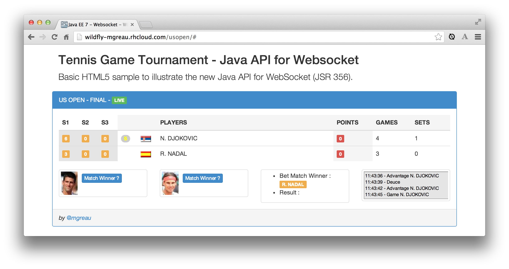

= WebSocket Java EE 7 - AngularJS - WildFly 8
Maxime Gréaun <@mgreau>
:imagesdir: .

This project shows how to use the WebSocket Protocol with :
* Java API for WebSocket (from Java EE 7 specifications)
* WebSocket HTML 5 / Javascript API (from W3C)
* AngularJS framework
* deployed on WildFly 8.0.0-Beta1

== Overview == 
There are 2 samples :

* the first one (/index.html) which handle a single match and used only native Javascript on view side
** online demo : http://wildfly-mgreau.rhcloud.com/usopen/
** local access : http://localhost:8080/usopen/

* the second (/matches.html) which is more complicated as it handles multiples matches and it used AngularJS on view side
** online demo : http://wildfly-mgreau.rhcloud.com/usopen/matches.html
** local access : http://localhost:8080/usopen/matches.html

image::doc/img/html5_websocket_angularjs.png[Screenshot of the WebSocket Java EE 7 demo with a severals matches and AngularJS]

== Install on your WildFly 8 application server
  
. Clone this project :  

  git clone https://github.com/mgreau/javaee7-websocket

. Start wildfly : 

   $JBOSS_HOME/bin/standalone.sh
   
. Build the war and deploy it automatically with maven : 

   mvn clean package jboss-as:deploy

. Launch the browser :

   ** 1 match : http://localhost:8080/usopen/index.html
   ** multiples matches : http://localhost:8080/usopen/matches.html

