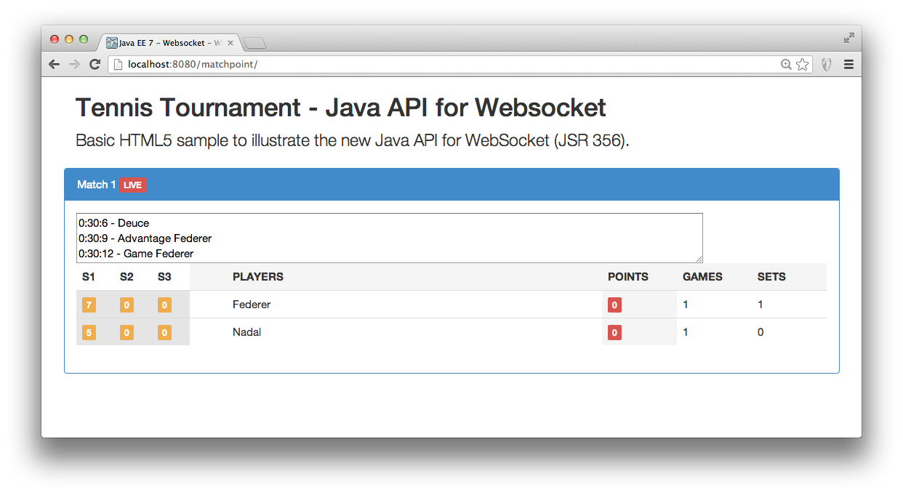
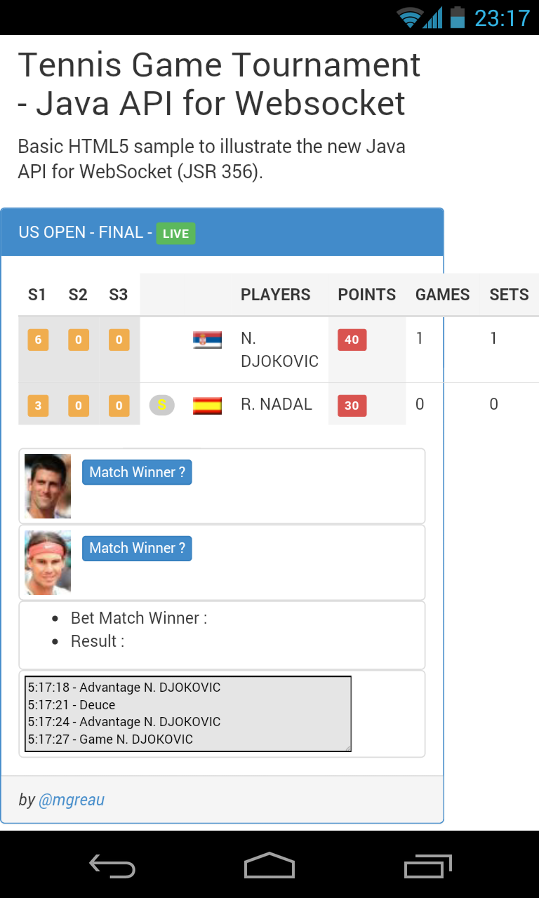

= WebSocket JavaEE 7 Demo
Maxime Gréaun <@mgreau>
:imagesdir: .

This project demonstrates how to use the WebSocket Protocol with Java API for WebSocket (from Java EE 7 specifications) and The WebSocket Javascript API (from W3C)

== Install

. Start wildfly : 

   $JBOSS_HOME/bin/standalone.sh
   
. Clone this project :  

  git clone https://github.com/mgreau/javaee7-websocket
  
. Build the war and deploy it automatically with maven : 

   mvn clean package jboss-as:deploy

. Launch the browser :

   http://localhost:8080/usopen/

== Demo / Screenshot
* Online demo : http://wildfly-mgreau.rhcloud.com/usopen/

